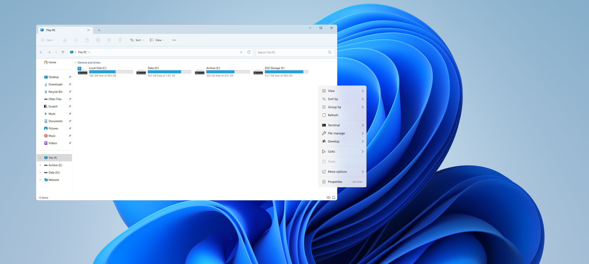
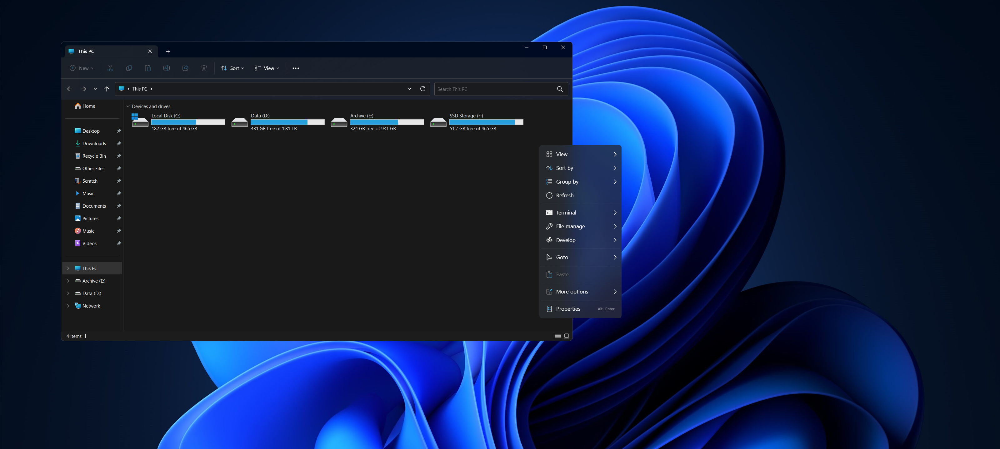

# Nilesoft Shell Presets
   
[Nilesoft](https://nilesoft.org/) | [Nilesoft Shell](https://github.com/moudey/shell)  

Currently for: [1.8 Beta (Link)](https://github.com/FaridZelli/Nilesoft-Shell-Presets/raw/main/Shell/shell-beta-1-8.zip)
   
1. Extract Nilesoft Shell to `ProgramFiles\Nilesoft\Shell`

2. Download the latest presets from [releases](https://github.com/FaridZelli/Nilesoft-Shell-Presets/releases/latest)

3. Rename `shell.shl.light-dark` to `shell.shl` and replace the file in the directory
   
---
- **Light**
---

   
---
- **Dark**
---

